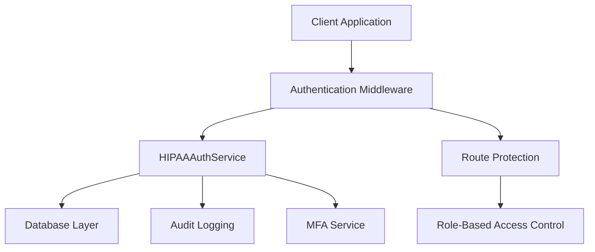
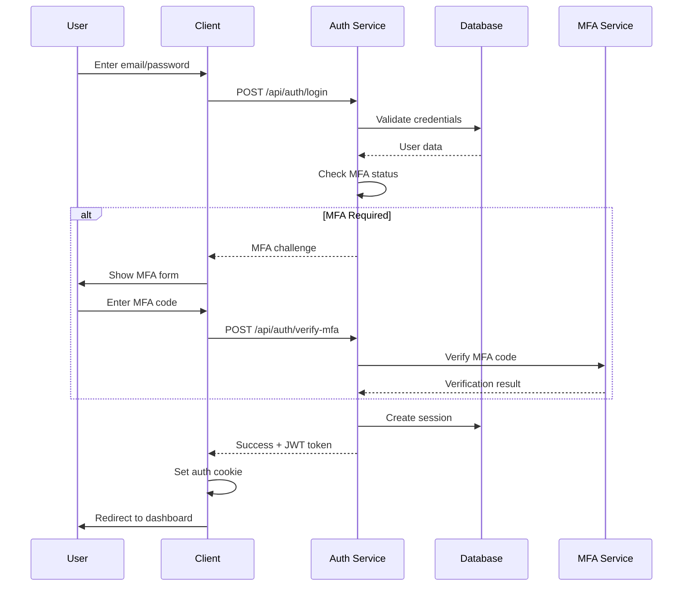
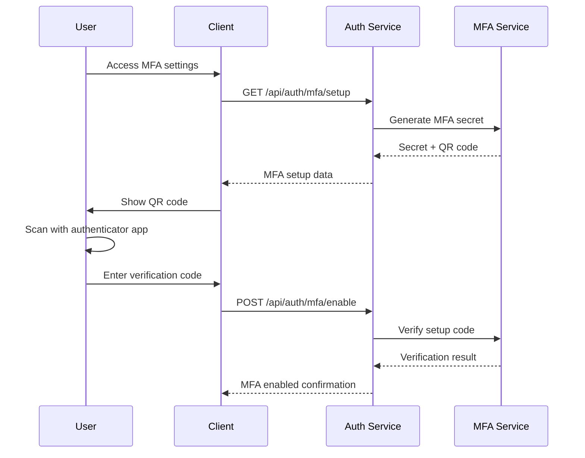
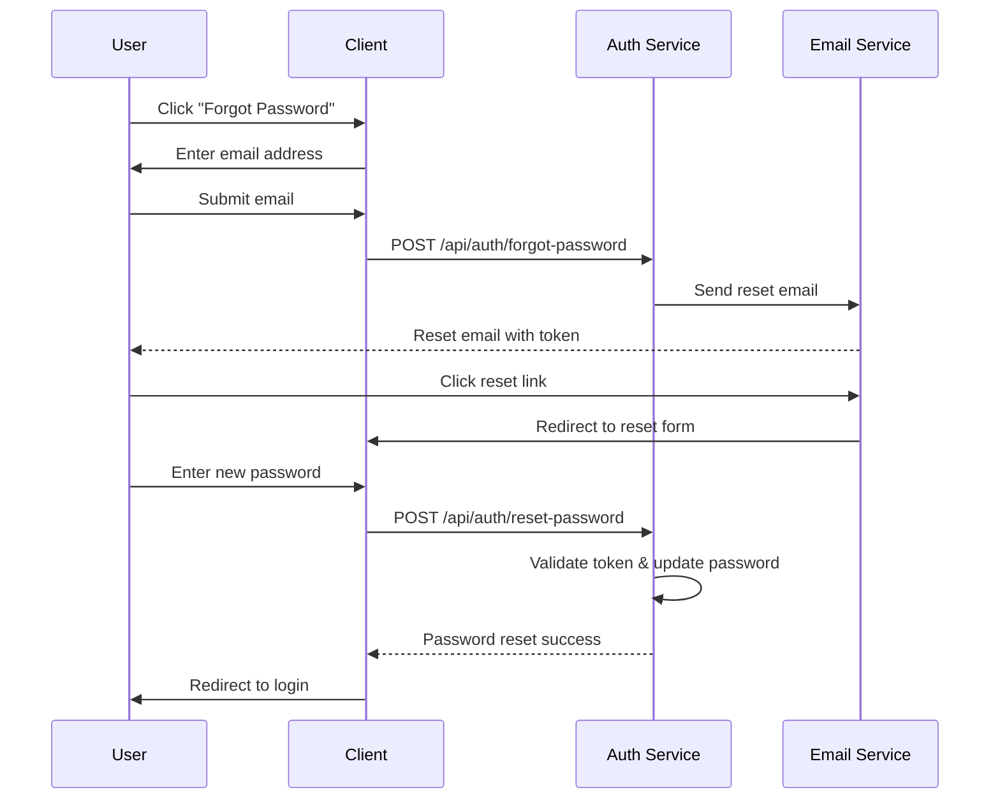

# Authentication System - Technical Documentation

## 📋 **Overview**

The Ihosi Healthcare Management System implements a custom HIPAA-compliant authentication system designed specifically for healthcare environments. This system provides secure, role-based access control with multi-factor authentication and comprehensive audit logging.

## 🏗️ **Technical Architecture**

### **System Components**



### **Core Technologies**
- **Framework**: Next.js 14 with App Router
- **Authentication**: Custom JWT-based system
- **Database**: PostgreSQL with Prisma ORM
- **Security**: bcryptjs for password hashing
- **MFA**: TOTP (Time-based One-Time Password)
- **Audit**: Comprehensive logging system

## 🔐 **Security Features**

### **1. Multi-Factor Authentication (MFA)**
```typescript
interface MFAConfig {
  enabled: boolean;
  methods: ('totp' | 'sms' | 'email')[];
  backupCodes: string[];
  gracePeriod: number; // minutes
}
```

**Supported MFA Methods:**
- **TOTP**: Google Authenticator, Authy, 1Password
- **SMS**: SMS-based verification codes
- **Email**: Email-based verification codes
- **Backup Codes**: One-time use recovery codes

### **2. Password Policy**
```typescript
const passwordPolicy = {
  minLength: 12,
  requireUppercase: true,
  requireLowercase: true,
  requireNumbers: true,
  requireSpecialChars: true,
  maxAge: 90, // days
  historyCount: 5, // prevent reuse
  complexityScore: 80 // minimum complexity score
};
```

### **3. Session Management**
```typescript
const sessionConfig = {
  duration: 8 * 60 * 60 * 1000, // 8 hours
  maxConcurrentSessions: 3,
  requireReauth: 30 * 60 * 1000, // 30 minutes for sensitive operations
  secureCookies: true,
  httpOnly: true,
  sameSite: 'strict'
};
```

### **4. Account Protection**
```typescript
const lockoutConfig = {
  maxAttempts: 5,
  lockoutDuration: 30 * 60 * 1000, // 30 minutes
  progressiveDelay: true,
  ipBasedLockout: true,
  adminOverride: true
};
```

## 🗄️ **Database Schema**

### **User Models**
```sql
-- Patient Authentication
ALTER TABLE "Patient" ADD COLUMN "password" TEXT NOT NULL;
ALTER TABLE "Patient" ADD COLUMN "mfa_secret" TEXT;
ALTER TABLE "Patient" ADD COLUMN "mfa_enabled" BOOLEAN DEFAULT false;
ALTER TABLE "Patient" ADD COLUMN "last_login_at" TIMESTAMP;
ALTER TABLE "Patient" ADD COLUMN "password_changed_at" TIMESTAMP DEFAULT CURRENT_TIMESTAMP;

-- Doctor Authentication
ALTER TABLE "Doctor" ADD COLUMN "password" TEXT NOT NULL;
ALTER TABLE "Doctor" ADD COLUMN "mfa_secret" TEXT;
ALTER TABLE "Doctor" ADD COLUMN "mfa_enabled" BOOLEAN DEFAULT false;
ALTER TABLE "Doctor" ADD COLUMN "last_login_at" TIMESTAMP;
ALTER TABLE "Doctor" ADD COLUMN "password_changed_at" TIMESTAMP DEFAULT CURRENT_TIMESTAMP;

-- Staff Authentication
ALTER TABLE "Staff" ADD COLUMN "password" TEXT NOT NULL;
ALTER TABLE "Staff" ADD COLUMN "mfa_secret" TEXT;
ALTER TABLE "Staff" ADD COLUMN "mfa_enabled" BOOLEAN DEFAULT false;
ALTER TABLE "Staff" ADD COLUMN "last_login_at" TIMESTAMP;
ALTER TABLE "Staff" ADD COLUMN "password_changed_at" TIMESTAMP DEFAULT CURRENT_TIMESTAMP;
```

### **Session Management**
```sql
-- UserSession (already exists)
model UserSession {
  id             Int      @id @default(autoincrement())
  user_id        String
  session_token  String   @unique
  ip_address     String
  user_agent     String
  created_at     DateTime @default(now())
  last_activity  DateTime @default(now())
  expires_at     DateTime
  is_active      Boolean  @default(true)
  logout_reason  String?
}

-- LoginAttempt (already exists)
model LoginAttempt {
  id             Int      @id @default(autoincrement())
  email          String?
  user_id        String?
  ip_address     String
  user_agent     String
  success        Boolean
  failure_reason String?
  attempted_at   DateTime @default(now())
}

-- UserLockout (already exists)
model UserLockout {
  id              Int      @id @default(autoincrement())
  user_id         String?
  email           String?
  ip_address      String
  locked_at       DateTime @default(now())
  unlock_at       DateTime
  reason          String
  failed_attempts Int      @default(0)
}
```

## 🔌 **API Reference**

### **Authentication Endpoints**

#### **POST /api/auth/login**
Authenticate user with email and password.

**Request:**
```json
{
  "email": "user@example.com",
  "password": "securePassword123!"
}
```

**Response (Success):**
```json
{
  "success": true,
  "user": {
    "id": "user-123",
    "email": "user@example.com",
    "role": "DOCTOR",
    "firstName": "John",
    "lastName": "Doe",
    "mfaEnabled": true,
    "lastLoginAt": "2024-01-15T10:30:00Z"
  },
  "message": "Login successful"
}
```

**Response (MFA Required):**
```json
{
  "success": true,
  "mfaRequired": true,
  "userId": "user-123",
  "message": "MFA verification required"
}
```

#### **POST /api/auth/verify-mfa**
Verify MFA code for user.

**Request:**
```json
{
  "userId": "user-123",
  "code": "123456"
}
```

**Response:**
```json
{
  "success": true,
  "user": {
    "id": "user-123",
    "email": "user@example.com",
    "role": "DOCTOR",
    "firstName": "John",
    "lastName": "Doe"
  },
  "message": "MFA verification successful"
}
```

#### **POST /api/auth/logout**
Logout user and invalidate session.

**Request:**
```json
{
  "sessionId": "session-123"
}
```

**Response:**
```json
{
  "success": true,
  "message": "Logout successful"
}
```

#### **GET /api/auth/me**
Get current user information.

**Response:**
```json
{
  "success": true,
  "user": {
    "id": "user-123",
    "email": "user@example.com",
    "role": "DOCTOR",
    "firstName": "John",
    "lastName": "Doe",
    "departmentId": "dept-456",
    "mfaEnabled": true,
    "lastLoginAt": "2024-01-15T10:30:00Z",
    "isActive": true
  }
}
```

## 🎨 **User Interface Design**

### **Design Principles**
- **Ihosi Brand Colors**: Deep Teal (#046658), Aquamarine Blue (#5AC5C8)
- **Modern UI**: Clean, professional healthcare interface
- **Accessibility**: WCAG 2.1 AA compliant
- **Responsive**: Mobile-first design approach
- **Security-First**: Clear security indicators and warnings

### **UI Components**

#### **1. Login Form**
```typescript
interface LoginFormProps {
  onSubmit: (email: string, password: string) => Promise<void>;
  loading: boolean;
  error?: string;
}
```

**Features:**
- Email and password fields
- "Remember me" option
- "Forgot password" link
- Loading states and error handling
- Ihosi branding and styling

#### **2. MFA Verification**
```typescript
interface MFAFormProps {
  userId: string;
  onVerify: (code: string) => Promise<void>;
  onResend: () => Promise<void>;
  loading: boolean;
  error?: string;
}
```

**Features:**
- 6-digit code input
- Resend code functionality
- Alternative MFA methods
- Clear instructions and help text

#### **3. Password Reset**
```typescript
interface PasswordResetProps {
  onRequestReset: (email: string) => Promise<void>;
  onResetPassword: (token: string, password: string) => Promise<void>;
  loading: boolean;
  error?: string;
}
```

**Features:**
- Email verification step
- Password strength indicator
- Password confirmation
- Security requirements display

## 🔄 **User Workflows**

### **1. Login Workflow**


### **2. MFA Setup Workflow**


### **3. Password Reset Workflow**


## 🧪 **Testing Strategy**

### **1. Unit Tests**
```typescript
describe('HIPAAAuthService', () => {
  describe('authenticate', () => {
    it('should authenticate valid user', async () => {
      // Test valid authentication
    });
    
    it('should reject invalid credentials', async () => {
      // Test invalid credentials
    });
    
    it('should handle account lockout', async () => {
      // Test lockout mechanism
    });
  });
  
  describe('verifyMFA', () => {
    it('should verify valid MFA code', async () => {
      // Test MFA verification
    });
    
    it('should reject invalid MFA code', async () => {
      // Test invalid MFA
    });
  });
});
```

### **2. Integration Tests**
```typescript
describe('Authentication API', () => {
  describe('POST /api/auth/login', () => {
    it('should return JWT token on successful login', async () => {
      // Test login endpoint
    });
    
    it('should return MFA challenge when MFA enabled', async () => {
      // Test MFA flow
    });
  });
});
```

### **3. Security Tests**
```typescript
describe('Security Tests', () => {
  it('should prevent brute force attacks', async () => {
    // Test account lockout
  });
  
  it('should validate password policy', async () => {
    // Test password requirements
  });
  
  it('should enforce session timeout', async () => {
    // Test session management
  });
});
```

## 🚨 **Troubleshooting**

### **Common Issues**

#### **1. Login Failures**
**Problem**: User cannot log in
**Solutions**:
- Check email/password combination
- Verify account is not locked
- Check MFA setup if enabled
- Verify account is active

#### **2. MFA Issues**
**Problem**: MFA verification fails
**Solutions**:
- Check device time synchronization
- Verify authenticator app setup
- Use backup codes if available
- Contact admin for MFA reset

#### **3. Session Expired**
**Problem**: User gets logged out unexpectedly
**Solutions**:
- Check session timeout settings
- Verify browser cookie settings
- Clear browser cache and cookies
- Check for multiple concurrent sessions

#### **4. Password Reset Issues**
**Problem**: Password reset not working
**Solutions**:
- Check email spam folder
- Verify reset token expiration
- Ensure password meets policy requirements
- Contact admin for manual reset

## 📊 **Monitoring & Metrics**

### **Key Metrics**
- **Login Success Rate**: Target > 95%
- **MFA Adoption Rate**: Target > 90%
- **Session Duration**: Average 4-6 hours
- **Failed Login Attempts**: < 5% of total attempts
- **Account Lockouts**: < 1% of users per day

### **Security Monitoring**
- **Failed Login Patterns**: Detect brute force attacks
- **Suspicious Activity**: Unusual login locations/times
- **MFA Bypass Attempts**: Monitor for security violations
- **Session Anomalies**: Detect compromised sessions

## 🔄 **Maintenance & Updates**

### **Regular Maintenance**
- **Password Policy Updates**: Quarterly review
- **Security Patches**: Monthly updates
- **Audit Log Review**: Weekly analysis
- **Performance Monitoring**: Continuous

### **User Training**
- **MFA Setup**: Step-by-step guides
- **Password Management**: Best practices
- **Security Awareness**: Regular training sessions
- **Troubleshooting**: Self-service resources

---

*This authentication system forms the foundation of our healthcare management system, ensuring secure access while maintaining a smooth user experience.*
